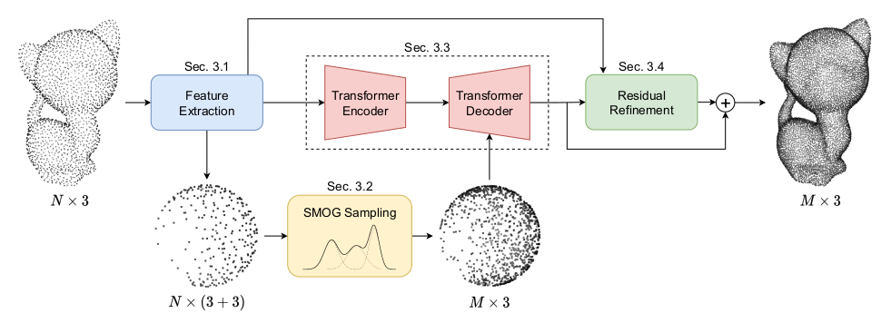

# APU-SMOG
Code for Arbitrary Point Cloud Upsampling with Spherical Mixture of Gaussians ([project page](https://apusmog.github.io))

## Prerequisite Installation
The code has been tested with Python 3.8, PyTorch 1.9 and Cuda 10.2:

    conda create --name apusmog python=3.8
    
    conda activate apusmog
    
    conda install pytorch=1.9.0 torchvision torchaudio cudatoolkit=10.2 -c pytorch
    
    pip install h5py python-graph-core scipy PyYAML
    
To build the third party extensions:

    cd third_party/lib_pointtransformer/pointops/
    python setup.py install

    cd third_party/pointnet2
    python setup.py install

## How to use the code: 
Download [PU1K dataset](https://drive.google.com/drive/folders/1k1AR_oklkupP8Ssw6gOrIve0CmXJaSH3) into the data/ folder.

Test on PU1K:

    python main.py --config configs/apusmog_pu1k_pretrained.yaml

Train on PU1K:

    python main.py --config configs/apusmog_pu1k.yaml

Evaluation:
    
    cd evaluation
    ./run_me.sh

    python compute_p2m.py --gt_dir ../data/PU1K/test/original_meshes/ --pred_dir ../checkpoints/apusmog_pu1k_pretrained/results/ --use_mp True
    python evaluate_tf_cpu.py --gt_dir ../data/PU1K/test/input_2048/gt_8192/ --pred_dir ../checkpoints/apusmog_pu1k_pretrained/results/ --save_path ../checkpoints/apusmog_pu1k_pretrained/metrics --use_p2f

## Citation
Please cite this paper with the following BibTeX:

    @inproceedings{delleva2022arbitrary,
        author = {Anthony Dell'Eva and Marco Orsingher and Massimo Bertozzi},
        title = {Arbitrary Point Cloud Upsampling with Spherical Mixture of Gaussians},
        booktitle = {International Conference on 3D Vision (3DV)},
        year = {2022}
    }

## Acknowledgement
Codebase borrowed from [3DETR](https://github.com/facebookresearch/3detr)